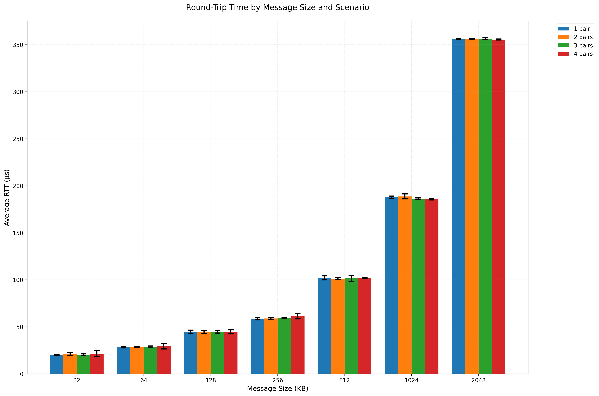

# MPI Point-to-Point Communication Latency Analysis

## Overview
This project implements and analyzes point-to-point message latency between pairs of nodes using MPI (Message Passing Interface). The implementation measures round-trip time (RTT) for different message sizes across various node pair configurations. In all four scenarios, the project specifically records only the message latency between a single pair of nodes to ensuring consistent comparison across different parallel communication setups. More specifically, it measures the round-trip message latency from the **process with Rank 0**, which sends the message, and records the response received from its partner process in the pair, the process with Rank 1.

## Implementation Details

### Core Components
- **p1.c**: Main MPI program implementing point-to-point communication
- **plot_p1.py**: Python script for data visualization which is shown in `p1.png`
- **Batch scripts**: SLURM job scripts for different scenarios

### Message Sizes
- Range: 32KB to 2MB
- Specific sizes: 32KB, 64KB, 128KB, 256KB, 512KB, 1MB, 2MB
- 10 iterations per size (**first iteration skipped for warm-up**)
- The first iteration is skipped because it includes additional overhead from initial setup costs such as cache misses, network path establishment, and MPI connection initialization. By skipping it, we get more accurate measurements of the steady-state communication performance rather than including these one-time initialization costs in our averages.

### Test Scenarios
1. One pair (2 nodes)
2. Two pairs (4 nodes)
3. Three pairs (6 nodes)
4. Four pairs (8 nodes)

## Methodology

### Data Collection
- Implemented synchronous send/receive using `MPI_Send()` and `MPI_Recv()` as shown in `p1.c`
- Collected statistics (average RTT and standard deviation) for the first pair (rank 0) only
- Skipped first iteration to avoid warm-up effects


## Results Analysis



### Key Observations
- There is a clear linear relationship between message size and latency across all scenarios.
- The latency increases proportionally with message size, starting from ~20μs for 32KB messages to ~356μs for 2MB messages.

### Latency Trends Across Message Sizes
- **Small message sizes (32 KB - 256 KB):**
  - RTT increases gradually from ~20μs to ~60μs.
  - The increase is relatively linear.
- **Larger message sizes (512 KB - 2 MB):**
  - RTT grows more steeply, reaching ~350μs for 2 MB.

### Standard Deviation Analysis
As we move from **Scenario 1 (1 pair)** to **Scenario 4 (4 pairs)**:
- **For small messages (32–256 KB):**
  - For the **first four message sizes**, as we go from Scenario 1 to Scenario 4, we see **increasing standard deviation**, particularly in Scenario 4. 

- **For large messages (512 KB – 2 MB):**
  - This pattern is **not the case** for message sizes **greater than or equal to 512 KB**.
  - The difference in standard deviation across scenarios varies. For example, for the message size of 512 KB, **Scenario 3** has the highest standard deviation, while for 1024 KB, **Scenario 2** has the highest standard deviation.


## Running the Code

### Steps
```bash

# Compile the MPI program
mpicc p1.c -lm -o p1

```

OR simply run the Makefile with the folllowign command

```bash

make

```

Both commands above will generate a file named p1.

```bash
# Install dependencies from requirements.txt
pip3 install --user -r requirements.txt
```

For each scenario, we allocate nodes and run the MPI program. The output will be saved in .txt files representing the collected data.

**Scenario 1: One Pair of Nodes (2 Nodes)**
```bash
salloc -N2 -n2 -p skylake
mpirun -np 2 ./p1 > scenario1.txt
exit
```

This will generate a file `scenario1.txt`

**Scenario 2: Two Pair of Nodes (4 Nodes)**
```bash
salloc -N4 -n4 -p skylake
mpirun -np 4 ./p1 > scenario2.txt
exit
```
This will generate a file `scenario2.txt`

**Scenario 3: Three Pair of Nodes (6 Nodes)**
```bash
salloc -N6 -n6 -p skylake
mpirun -np 6 ./p1 > scenario3.txt
exit
```
This will generate a file `scenario3.txt`

**Scenario 4: Four Pair of Nodes (8 Nodes)**
```bash
salloc -N8 -n8 -p skylake
mpirun -np 8 ./p1 > scenario4.txt
exit
```

This will generate a file `scenario4.txt`


Automating with SLURM Scripts
Using batch scripts:

```bash
chmod +x scenario1.slurm scenario2.slurm scenario3.slurm scenario4.slurm run_scenarios.sh
./run_scenarios.sh
```

You can monitor the running jobs with:
```bash
squeue -u $USER
```

Plotting the Results
After collecting the data from all scenarios, generate the plot using:

```bash
python3 plot_p1.py
```
This will generate a file `p1.png`

